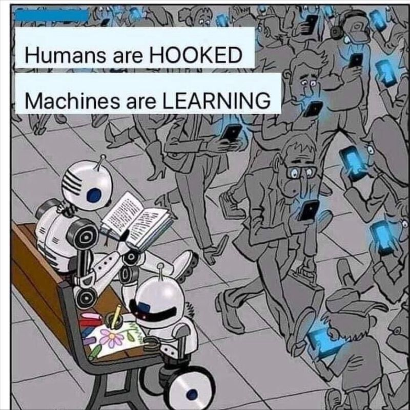

<!--- Header --->

<!---

--->

 Emerging Computer Science Luminary | Illuminating Possibilities with AI, AGI, and Big Data  
🔬 Data Science, Python Virtuoso | Crafting Insights from Data  
🚀 Empowering Teams, Inspiring Change | Merging Science with Imagination  
🌱 Mark 'Nature' Chindudzi | “munhu munhu muvanhu” (UBUNTU)

- **Africa University** “Investing in Africa’s Future”
  - Bachelor of Science Honours in Computer Science
  - August 2023 - June 2027
  - 📍 Mutare, Manicaland Province, Zimbabwe

- Open to project collaborations
- You can reach me through:  

- 

- **NOTE** : You can **fork** and **contribute** to any of the projects 

- **Internships**
  - Machine Learning Internship & Artificial Intelligence Internship at InternCareer  
    🍭 "We speak Data" ~ Virtual, May-July 2024
  - Data Analyst Internship at MeriSKILL  
    🍭 "Gain Work Experience. Anytime, Anywhere." ~ Virtual, July 2024
  - Data Science Intern at Oasis Infobyte 
    🍭 "Be a team player." ~ Virtual, Aug 2024
 

<!--- Hobbies Label --->

  
🌱Hobbies

🍽️ 🛌 👨🏻‍💻 💪 🔁 
  
  🎹 Learning to play Piano
  💪 WorkingOut
  👨‍🍳 Junior Chef
  🧁 Baking
  📸 Photography

<!-- visitcount -->

    
    

 

<!--- Image -->
 

 

<!--- QUOTE -->
### 🎲 Random Dev Quote

## Languages and Tools 

### Languages:
| Python3 | C# | JS | R | Java |
|----------|----------|----------|-----|-----|
|   |   |   |  | |

### Best frameworks and main libraries for Python3:

| Pytorch | Selenium | Numpy | Pandas | Sklearn | Matplotlib | OpenCV |
|----------|----------|----------|----------|----------|----------|----------|
|  |  |  |  |  |  | |

### My tools for Data Manipulation:

| Conda | Jupyter | MySQL |
|----------|----------|----------|
||||

<!--- Image --->

    

<!---SNAKE---> 

 

## Portfolio Analysis  
  

  

  
  

---

<!--- Image --->

  

<!--- FOOTER ---> 

     

<!--- Python Logo --->

<!-- Proudly Assambled with Nature -->

<!---
marknature/marknature is a ✨ special ✨ repository because its `README.md` (this file) appears on your GitHub profile.
You can click the Preview link to take a look at your changes.
--->
